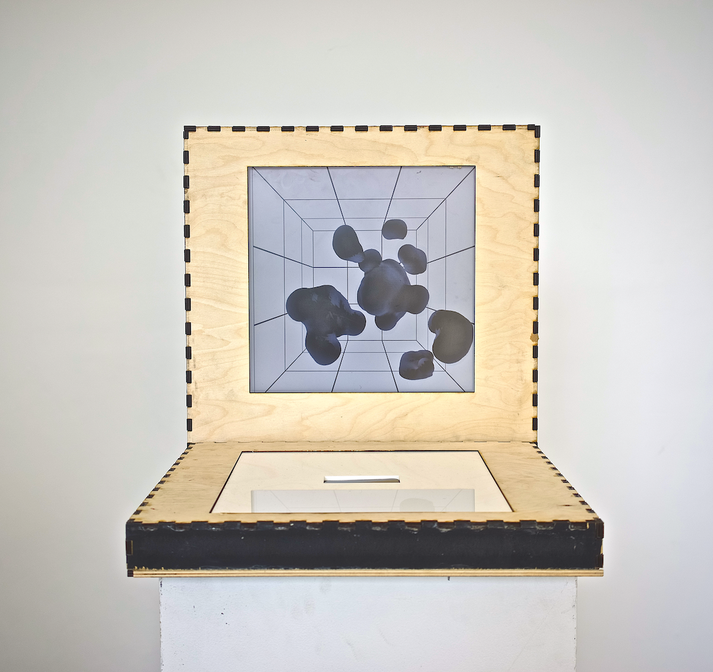
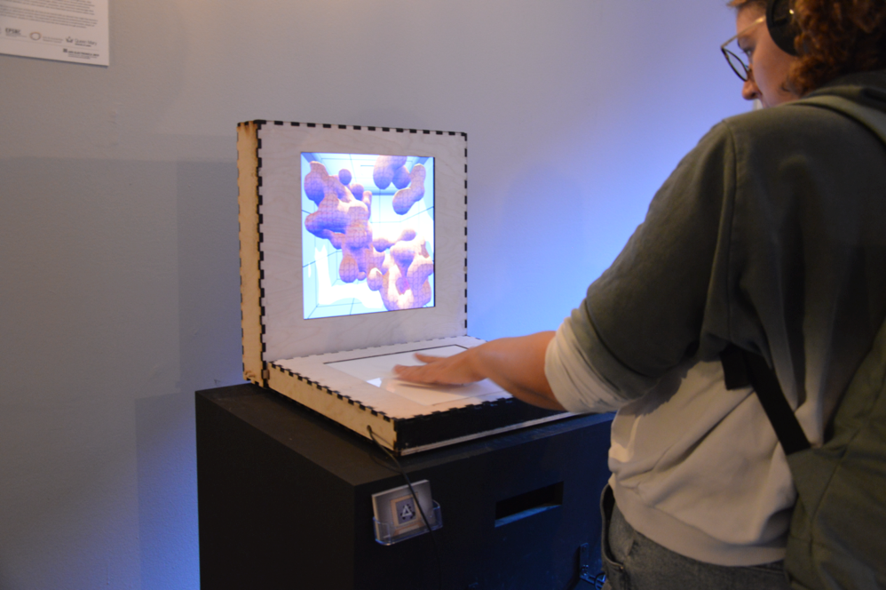

After getting my hands on a <a rel="noopener noreferrer" target="_blank" href="https://developer.leapmotion.com/">Leap Motion Sensor</a> that can capture hand movements, I developed this project to explore scenarios that are easy to navigate with your hands, but difficult with a mouse and keyboard. This inspired creating a digital 3-dimensional environnement containing a *liquid blob* that users can manipulate and reconfigure. You can have a look at this video to get an idea:

`youtube:https://www.youtube.com/watch?v=LvlyQzGB4rI&t=1s`

While this is a quirky demonstration without a real-life application in mind, it is interesting to see the different ways in which we could interact with our computers. The setup definitely makes it much easier to interact with a digital 3D object asking the question of what kind of other applications could be developed with this concept? 

You can see a large change in design between the video and the image above. Testing the *Blobbox* with different people made me realise that the original design was only accessible for users of a specific height. The new design proved to be a lot more flexible and was enjoyed by children and fully-grown adults at the <a rel="noopener noreferrer" target="_blank" href="https://ars.electronica.art/outofthebox/en/">Ars Electronica Festival 2019</a> and <a rel="noopener noreferrer" target="_blank" href="https://www.peckhamdigital.org/">Peckham Digital 2021</a>.

