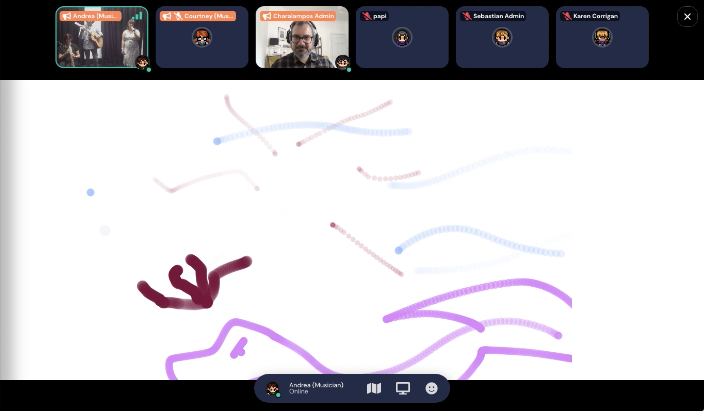

The larger *Seeing Music* project was started by researchers from 
the <a target="_blank" rel="noopener noreferrer" href="http://c4dm.eecs.qmul.ac.uk/">Centre for Digital Music</a> at Queen Mary University of London and the <a target="_blank" rel="noopener noreferrer" href="https://www.ncl.ac.uk/elll/research/linguistics/lead/">Lead Research Group</a> at Newcastle University with the aim to create a **virtual interactive hub** to present research that looks at how our senses work together. The project has a strong focus on reaching people beyond academia and was funded by the <a target="_blank" rel="noopener noreferrer" href="https://www.qmul.ac.uk/publicengagement/)">Centre for Public Engagment</a> at Queen Mary. The hub is online at <a target="_blank" rel="noopener noreferrer" href="https://www.seeingmusic.app/">seeingmusic.app</a>.

The *Seeing Music* app that I developed to be ready for the <a target="_blank" rel="noopener noreferrer" href="https://www.sciencefestival.co.uk/">Edinburgh Science Festival</a> in 2021 invites visitors to help an "alien Ai" understand human music through visual inputs. Visitors can create visualisations with three different tools while listening to compositions from various artists who created music specifically for this project. For the researchers, this data is interesting to find out more about how people associate different music with shapes, colours and textures. You can give it a go yourself <a target="_blank" rel="noopener noreferrer" href="https://www.seeingmusic.app/see-music">here</a>.

In addition to the app, I also developed a live, collaborative drawing interface for two live events that took place during the Edinburgh Science Festival 2021. The events happened virtually in <a target="_blank" rel="noopener noreferrer" href="https://www.gather.town/">Gather</a> and visitors were invited to explore different rooms, open the interface and draw their interpretations of different prompts that went from figurative things like *sunset* or *ocean waves* to more complex concepts like *the feeling of missing a friend* or *the taste of ice cream in summer*. The outcome was then interpreted by different musicians who were placed in the rooms and could only see the drawings without the prompts.

This was a great project attracting many visitors from all over the world. For me, it was a good opportunity to improve my skills in **React**, **Heroku** and **MongoDB**.