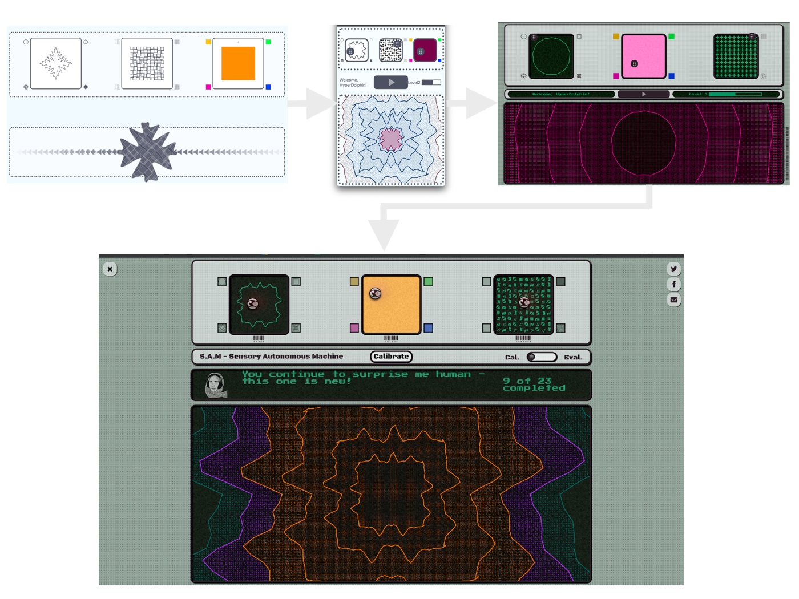

<a target="_blank" rel="noopener noreferrer" href="https://www.seeingmusic.app/">*Seeing Music*</a> was started by researchers of 
the <a target="_blank" rel="noopener noreferrer" href="http://c4dm.eecs.qmul.ac.uk/">Centre for Digital Music</a> at Queen Mary University of London and the <a target="_blank" rel="noopener noreferrer" href="https://www.ncl.ac.uk/elll/research/linguistics/lead/">LEAD Research Group</a> at Newcastle University with the aim to create a **virtual interactive hub** of engaging reserach works focusing on human perception. 

The *Seeing Music* gamed is based on research question about the kind of shapes, textures and colours people associate with different types of music. I started the project with defining the exerimental research design with my collaborators and developing algorithms to generate different shapes, textures and colours from a user input before focusing on the interface and interaction design. I followed an **iterative process** where at each stage a prototype was tested with a **focus group** including individual **think-aloud studies** and a **group discussion** together with **expert evaluation** of a research at the Intelligent Games and Game Intelligence CDT (<a target="_blank" rel="noopener noreferrer" href="https://iggi.org.uk/">IGGI</a>). 

From the evaluation stages we learned that the game got boring very quickly in the beginning. This was adressed by creating a narrative about helping an "alien Ai" understand human music through visual inputs, implementing a levelling system in which players could unlock new visual inputs, play modes and music and an aesthetic that matched the sci-fi theme of the narrative. You can give it a go yourself <a target="_blank" rel="noopener noreferrer" href="https://www.seeingmusic.app/see-music">here</a>.

This was a great project that attracted 1,000+ visitors and counting. Running thorough evaluation tests really helped to make meaningful improvements to the interface. I believe that the project shows a lot of potential and could be developed further into a more complex game that is not only entertaining but also contributes to research. 
