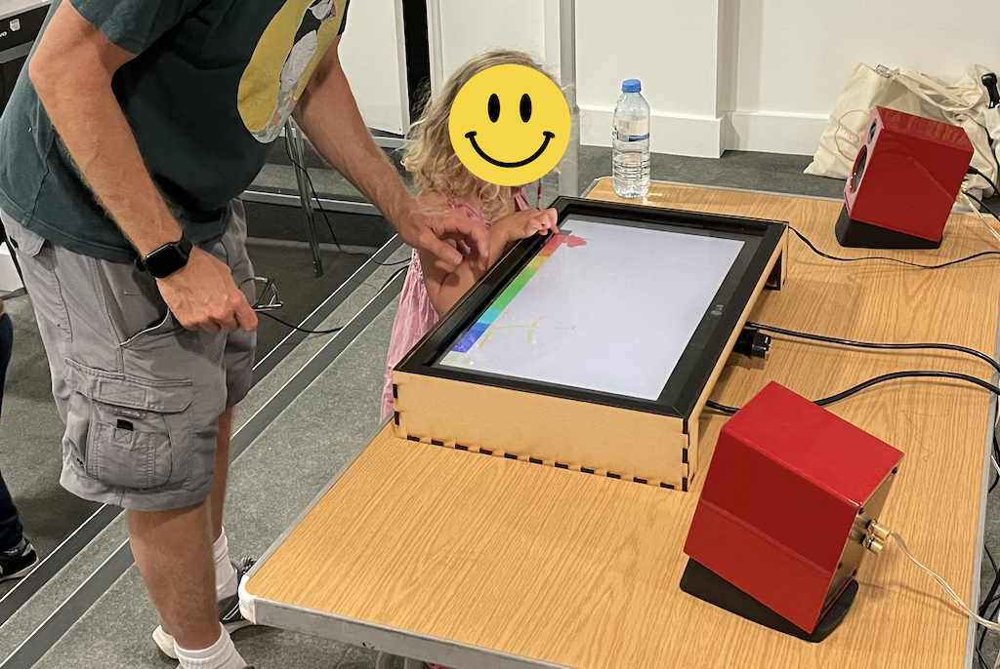

I built a touchscreen from a computer screen, a transparent touchpad and plywood using a laser cutter. The digital drawing interface was created with the JavaScript library p5.js to run completely in a web browser. 