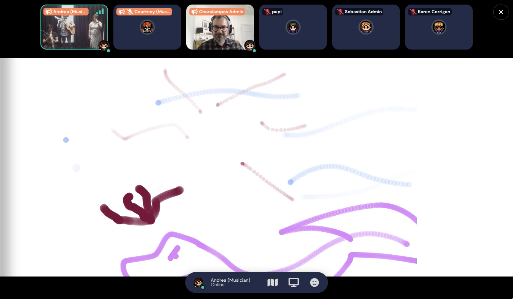

I built a touchscreen from a computer screen, a transparent touchpad and plywood using a laser cutter. The digital drawing interface was created with the JavaScript library p5.js to run completely in a web browser. The project is a continuation of the Seeing Music project which is described in a post <a href="#seeingmusic" rel="noopener noreferrer">further down this page.</a> We are interested to find out how people represent music through drawing, which could help us to develop new ways to interact with music, for example by training Artificial Intelligence to understand music through visual input. At the Edinburgh Science Festival 2021, we presented an online version of this project that allowed visitors to collaborative draw on a shared canvas over the internet. Through this engaging design we managed to collect drawings from over 200 visitors. 

