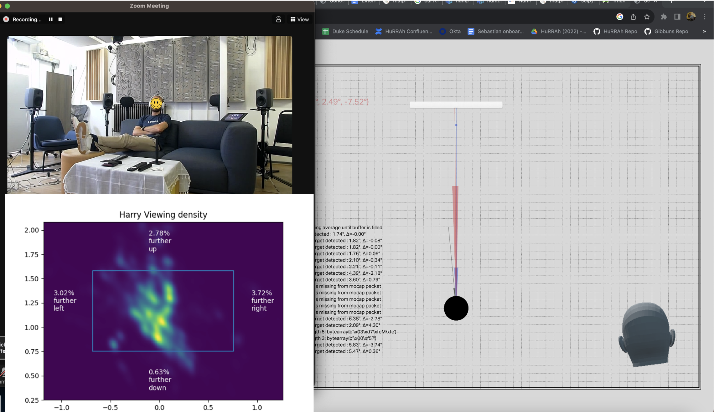
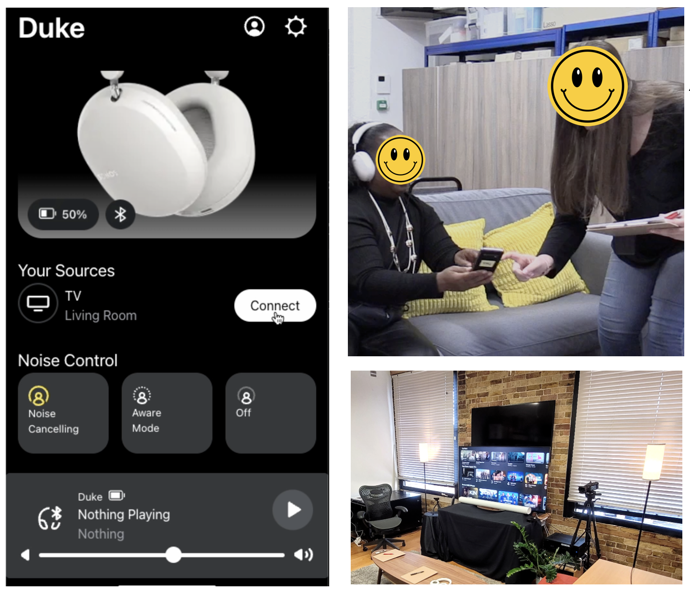

The first step I took when starting at Sonos was to bring together individual components to build up a realistic TV watching scenario with the <a target="_blank" rel="noopener noreferrer" href="https://www.sonos.com/en-gb/shop/sonos-ace">Ace headphones</a>. This included connecting the headphones' spatial renderer and head-tracking to Apple TV. I was interested in finding out the current state of the technology and how people interact with it. By setting up motion capture and head-tracker logging, I was able to study viewer behaviour. I analysed data from seven employees and found that people moved much less while watching TV than anticipated. This insight helped streamline head-tracking transitions. Additionally, I identified issues with audio sources not staying fixed, which led to a larger investigation into <a target="_blank" rel="noopener noreferrer" href="https://www.mouser.co.uk/new/bosch/bosch-bhi360-smart-sensor/">head misalignment calibration (HMC)</a> and <a target="_blank" rel="noopener noreferrer" href="https://en.wikipedia.org/wiki/Head-related_transfer_function">head-related transfer function (HRTF)</a>.  

I collected HMC data from 62 participants over three sessions, enabling the calculation of an ideal average HMC profile and eliminating the need for manual calibration. I developed tools to allow unsupervised HMC data collection, visualise HMC data, and perform A/B testing to investigate the impact of different HMC profiles on sound experience.

My research at Sonos concluded with developing a comprehensive prototype of the home cinema experience, which included spatial audio rendering, head-tracking, <a target="_blank" rel="noopener noreferrer" href="https://www.t3.com/features/what-is-sonos-truecinema-how-it-works">TrueCinema</a> setup and adaptation, <a target="_blank" rel="noopener noreferrer" href="https://support.sonos.com/en-gb/article/listen-to-home-theater-audio-on-sonos-ace-with-tv-audio-swap">TV audio swap</a>, active noise cancellation (ANC) modes, and a mobile browser mockup of the new Sonos app for Ace. This prototype allowed us to seamlessly test all home cinema features with external participants. The study enabled us to refine technical parameters, improve copy writing, capture valuable qualitative and quantitative data on user behaviour and expectations, and provide a template for collaborative testing between engineers, and UX researchers before product maturity.

I think this project highlights the importance of connecting engineering and user experience at an early point. Being able to conduct user testing with a functioning system at an early stage, enables a company to catch issues early before a project goes into production, thus saving time and money in the long run.